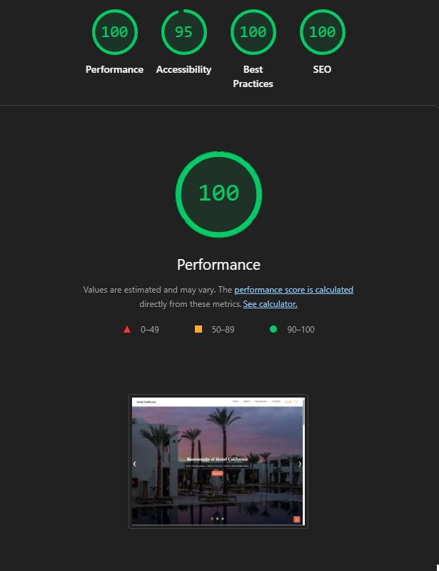
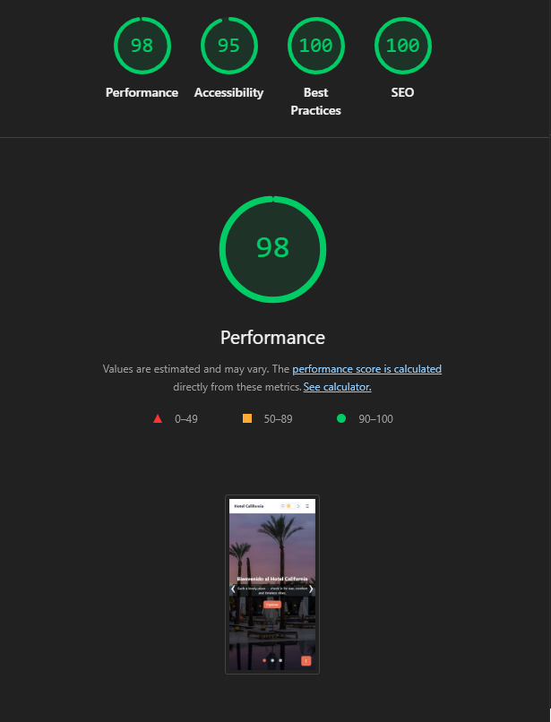

# Hotel California - Technical Test

This is the implementation of the technical test for "Maquetador Web".
Features:

- Semantic HTML, SCSS, JS modules
- Parcel dev/build (SCSS compiled automatically)
- Accessible hamburger menu, hero slider, filterable masonry gallery, lightbox, theme toggle, footer
- Images are lazy; performance & SEO considerations included

## Run locally

```bash
npm install
npm run dev
```

## Build

```bash
npm run build
```

## Lighthouse
Web


Mobile
